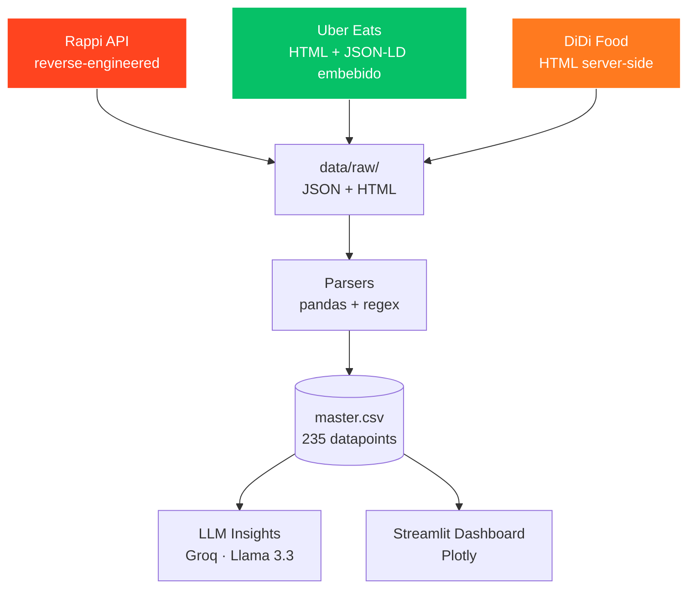

🍔 Competitive Intelligence — Rappi vs Uber Eats vs DiDi Food

Sistema de scraping automatizado que recolecta datos de pricing, fees y operación de **McDonald's en CDMX** a través de Rappi, Uber Eats y DiDi Food, y genera insights accionables para los equipos de Pricing y Strategy de Rappi.

**Caso técnico — AI Engineer @ Rappi · Jhonatan Guerrero**

---

## 📊 Resultados

- **3 plataformas** scrapeadas (Rappi, Uber Eats, DiDi Food)
- **8 zonas de CDMX** con mix de poder adquisitivo (Polanco, Santa Fe, Roma Norte, Del Valle, Coyoacán, Centro Histórico, Iztapalapa, Ecatepec)
- **235 datapoints** sobre 4 productos comparables (Big Mac Tocino, McTrío Big Mac, McNuggets 10pz, Coca-Cola)
- **Cobertura 100%**: las 3 plataformas tienen McDonald's en las 8 zonas
- **Top 5 insights** generados con LLM (Llama 3.3 70B vía Groq) sobre el dataset completo
- **Dashboard interactivo** en Streamlit con visualizaciones plotly

---

## 🎯 Hallazgos clave (preview)

1. **Rappi tiene ventaja exclusiva en Santa Fe**: Big Mac a $145 MXN vs $165 en DiDi y Uber Eats (-12%). Único caso donde Rappi es estrictamente más barato.
2. **Uber Eats subsidia agresivamente Iztapalapa**: Big Mac a $115 MXN (-21% vs $145 de Rappi/DiDi), señal de penetración de zona de bajo poder adquisitivo.
3. **Rappi y DiDi siguen el "precio oficial" de McDonald's MX** en 7 de 8 zonas, mientras que **Uber Eats es el outlier estratégico** con descuentos selectivos.
4. **Uniformidad de delivery fee**: Rappi cobra **$9.90 MXN en TODAS las zonas**, sin variabilidad geográfica, vs ETA que varía 2x (Santa Fe 12min ↔ Ecatepec 25min).
5. **McTrío Big Mac**: Uber Eats es 23-29% más caro en combos que Rappi en casi todas las zonas → estrategia de margen vs volumen.

---

## 🏗️ Arquitectura



### Decisiones técnicas

| Plataforma | Approach | Justificación |
|---|---|---|
| **Rappi** | API reversa (`services.mxgrability.rappi.com`) | Endpoint `restaurant-bus/store/brand/id/{id}` devuelve store + menú + fees + ETA en 1 request. La geo va en el body (`lat`/`lng`), por lo que **se evita el bloqueo por IP no-mexicana**. |
| **Uber Eats** | HTTP GET + parseo de JSON-LD `Restaurant` | Uber Eats embebe el menú completo como Schema.org en el HTML server-side (originalmente para SEO). 1 request por store, sin headless browser. |
| **DiDi Food** | HTTP GET + BeautifulSoup sobre HTML server-side | Las páginas públicas de restaurantes (`web.didiglobal.com/mx/food/...`) renderizan productos y precios server-side sin login. URLs descubiertas vía SEO público. |

**Por qué NO usamos Playwright/Selenium:** las 3 plataformas exponen sus datos sin necesidad de un browser headless. Eso reduce el tiempo de scraping de minutos a segundos por zona, evita issues de fingerprinting, y hace el sistema reproducible en CI/CD.

---

## 🚀 Setup

### Requisitos
- Python 3.13 (probado en Windows 11, debería correr en Linux/Mac)
- Cuenta gratuita de [Groq](https://console.groq.com) para los insights LLM

### Instalación

```bash
git clone https://github.com/Jhonatan-GS/rappi-competitive-intelligence
cd rappi-competitive-intelligence
python -m venv venv
# Windows
.\venv\Scripts\Activate.ps1
# Linux/Mac
source venv/bin/activate
pip install -r requirements.txt --only-binary=:all:
```

### Variables de entorno

Crear `.env` en la raíz:
GROQ_API_KEY=gsk_xxx                 # Para insights LLM
RAPPI_AUTH_TOKEN=ft.gAAAA...         # Token Bearer anónimo (capturar de DevTools en rappi.com.mx)
RAPPI_DEVICE_ID=xxx-xxx-xxx          # Device ID asociado al token

> **Nota sobre el token de Rappi**: es un token de sesión anónima que Rappi entrega a cualquier visitante. Para refrescarlo: abrir `rappi.com.mx` en incógnito → DevTools → Network → buscar cualquier request a `services.mxgrability.rappi.com` → copiar el header `authorization`.

---

## ▶️ Uso

### Pipeline completo

```bash
# 1. Scraping (las 8 zonas en cada plataforma)
python -m src.scrapers.rappi_runner
python -m src.scrapers.ubereats_runner
python -m src.scrapers.didi_runner

# 2. Parseo y normalización a CSV
python -m src.analysis.parser_rappi
python -m src.analysis.parser_ubereats
python -m src.analysis.parser_didi

# 3. Unificación a master dataset
python -m src.analysis.unify

# 4. Generación de insights con LLM
python -m src.analysis.insights

# 5. Dashboard interactivo
streamlit run dashboard.py
```

### Outputs

- `data/raw/{platform}/` — JSONs y HTMLs crudos por zona (debugging y reproducibilidad)
- `data/processed/{platform}_mcdonalds.csv` — datasets normalizados por plataforma
- `data/processed/master.csv` — dataset unificado (235 filas)
- `data/processed/insights.json` — top 5 insights estructurados
- Dashboard en `http://localhost:8501`

---

## 📐 Metodología

### Selección de zonas

Las 8 zonas se eligieron para cubrir un mix representativo de tiers de poder adquisitivo y tipologías urbanas en la zona metropolitana de CDMX:

| Zona | Tier | Justificación |
|---|---|---|
| Polanco | premium | Wealthy urbano, alta densidad |
| Santa Fe | premium | Corporativo, alta demanda business |
| Roma Norte | mid-high | Hipster/foodie, alta competencia |
| Del Valle | mid-high | Residencial medio-alto |
| Coyoacán | mid | Residencial tradicional |
| Centro Histórico | mid | Turístico, alta rotación |
| Iztapalapa | low | Periférico, bajo poder adquisitivo |
| Ecatepec | low | Edomex, periférico real |

### Selección de productos

Solo McDonald's, único brand presente en las 3 plataformas con SKUs idénticos. 4 productos de referencia:

- **Big Mac Tocino** ($115–$165 MXN)
- **McTrío Big Mac** (combo, $139–$218 MXN)
- **McNuggets 10pz** ($145–$179 MXN)
- **Coca-Cola** ($49–$65 MXN)

### Mismo store físico cuando es posible

Donde el directorio público de DiDi y Uber Eats coincide con un store físico ya scrapeado en Rappi, se hace **comparación apples-to-apples del mismo restaurante en las 3 plataformas** (ej: Plaza Galerías en Polanco aparece idéntico en las 3).

---

## ⚠️ Limitaciones conocidas

| Limitación | Causa | Mitigación |
|---|---|---|
| **No se obtiene delivery fee de Uber Eats / DiDi Food** | Estos campos solo aparecen al iniciar sesión con cuenta MX o al pasar por el flujo de checkout completo. | Documentado en el dashboard. Comparación de fees solo para Rappi. |
| **DiDi Food requiere login con número MX para checkout completo** | Anti-fraude regional. | Usamos las páginas SEO públicas (`web.didiglobal.com/mx/food/...`) que sí muestran productos y precios. |
| **Snapshot de un solo punto en el tiempo** | El scraping fue ejecutado el 7 de octubre de 2025. Promociones dinámicas pueden variar hora a hora. | Pipeline es reproducible, se puede correr periódicamente vía cron/GitHub Actions. |
| **Solo McDonald's** | Único brand con SKUs idénticos y presencia confirmada en las 3 plataformas en CDMX. | Pipeline modular, se puede extender a Burger King, KFC, etc. cambiando `MCDONALDS_BRAND_ID` y los store paths. |
| **Sin VPN mexicana** | Restricción de tiempo (12h de desarrollo). Rappi funciona sin VPN porque la geo va en el body del request; Uber Eats y DiDi sí responden a IP colombiana porque las páginas son SEO-públicas. | Documentado, no impactó la calidad del scraping en este caso. |

---

## 🛠️ Stack técnico

- **Scraping**: `httpx` (sync), `BeautifulSoup`, `tenacity` (retries con backoff exponencial)
- **Parsing**: `pandas`, regex compilados
- **Análisis**: `pandas`, `plotly`
- **LLM**: `groq` (Llama 3.3 70B, free tier)
- **Dashboard**: `streamlit`
- **Logging**: `loguru`
- **Config**: `python-dotenv`

**Costo total del scraping: $0** (todas las APIs son gratuitas o públicas, no se usaron proxies pagos ni servicios de scraping).

---

## 📂 Estructura del proyecto

```text
rappi_competitive_intelligence/
├── src/
│   ├── config.py                  # Zonas, store paths, brand IDs
│   ├── llm_provider.py            # Wrapper de Groq
│   ├── scrapers/
│   │   ├── rappi.py               # Cliente API Rappi
│   │   ├── rappi_runner.py        # Orquestador 8 zonas
│   │   ├── ubereats.py            # Cliente HTML + JSON-LD
│   │   ├── ubereats_runner.py
│   │   ├── didi.py                # Cliente HTML + BeautifulSoup
│   │   └── didi_runner.py
│   └── analysis/
│       ├── parser_rappi.py        # JSON → CSV normalizado
│       ├── parser_ubereats.py
│       ├── parser_didi.py
│       ├── unify.py               # Merge de los 3 CSVs
│       └── insights.py            # Top 5 insights con LLM
├── data/
│   ├── raw/{rappi,ubereats,didi}/ # JSONs y HTMLs crudos
│   └── processed/                 # CSVs y master.csv
├── dashboard.py                   # Streamlit app
├── requirements.txt
├── .env                           # NO commiteado
├── .gitignore
└── README.md
```
---

## 🔄 Reproducibilidad

El sistema completo se puede ejecutar end-to-end en menos de 2 minutos:

- **Scraping**: 8 zonas × 3 plataformas × ~3s/request = ~75 segundos
- **Parsing + unify**: <5 segundos
- **Insights LLM**: ~10 segundos (1 request a Groq)
- **Total**: ~90 segundos

---

## 🧭 Próximos pasos (con más tiempo)

- [ ] Capturar delivery fee y service fee de Uber Eats vía Playwright + cuenta MX
- [ ] Análisis temporal: scrapeo programado cada 4 horas vía GitHub Actions, detectar promociones dinámicas
- [ ] Extender a más brands (Burger King, KFC, Domino's) para validación cruzada
- [ ] Agregar verticales: retail (OXXO, 7-Eleven), pharmacy (Farmacias del Ahorro)
- [ ] Tests unitarios sobre los parsers (regex de productos, normalización de zones)
- [ ] Containerizar con Docker para deployment en cloud

---

## 🤝 Consideraciones éticas

Este sistema realiza scraping de **datos públicos** de pricing visibles a cualquier usuario que visite las plataformas:

- Rate limiting de 2-3 segundos entre requests para no saturar servidores
- User-Agents reales (no se ocultan como bot)
- Solo se accede a datos que cualquier usuario humano puede ver sin autenticación
- Sin acceso a información personal de usuarios o comerciantes
- Pensado exclusivamente para análisis de competitive intelligence interna de Rappi

---

**Autor**: Jhonatan Guerrero  
**Caso técnico**: AI Engineer @ Rappi
**Tiempo de desarrollo**: horas (incluyendo reconocimiento, scraping, análisis, dashboard y documentación)
